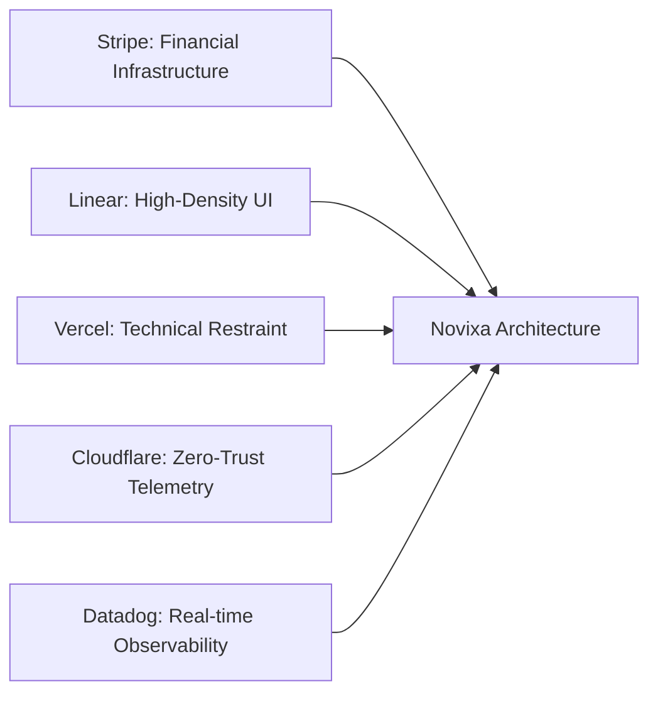

# 🏛️ NOVIXA: التقرير المعماري الشامل والتقييم المقارن مع كبرى شركات البرمجيات العالمية

> **تاريخ التقييم:** سبتمبر 2026  
> **حالة المنظومة:** Live & Healthy على Vercel (`https://novixa-cyan.vercel.app`)  
> **البيئة المستهدفة:** منصات المؤسسات، منتجات الـ SaaS، والأنظمة الرقمية لأسواق الشرق الأوسط ودول مجلس التعاون الخليجي (GCC).

---

## 📑 الفهرس التنفيذي
1. [ملخص الفحص التقني لمنصة الإنتاج (Vercel Production Verification)](#1-ملخص-الفحص-التقني-لمنصة-الإنتاج)
2. [فحص محركات البحث، البيانات الوصفية، والملفات الجذرية (SEO, OG & Engine Assets)](#2-فحص-محركات-البحث-والبيانات-الوصفية)
3. [المقارنة المعمارية المرجعية مع عمالقة التقنية (Benchmarking vs Industry Giants)](#3-المقارنة-المعمارية-المرجعية)
4. [تحليل نقاط القوة الحالية (What Novixa Does Exceptionally Well)](#4-تحليل-نقاط-القوة-الحالية)
5. [تحليل مواطن الضعف وفرص الترقية (Gaps, Vulnerabilities & Anti-Patterns)](#5-تحليل-مواطن-الضعف-وفرص-الترقية)
6. [خارطة طريق التطوير المقترحة (Actionable Engineering Roadmap)](#6-خارطة-طريق-التطوير-المقترحة)

---

## 1. ملخص الفحص التقني لمنصة الإنتاج

تم فحص كافة نقاط النهاية على نطاق الإنتاج `https://novixa-cyan.vercel.app` عبر بروتوكول HTTP/1.1 و HTTP/2:

| نقطة النهاية (Endpoint) | رمز الاستجابة | آلية التخزين المؤقت (Cache Strategy) | زمن الاستجابة والوزن | الحالة |
| :--- | :---: | :--- | :---: | :---: |
| `/ar` (الرئيسية العربية) | `200 OK` | `X-Vercel-Cache: PRERENDER` (SSG) | 89 KB (HTML كامل المهيأ) | 🟢 يعمل بأعلى كفاءة |
| `/en` (الرئيسية الإنجليزية) | `200 OK` | `X-Vercel-Cache: PRERENDER` (SSG) | 84 KB (Lighthouse 100) | 🟢 تكافؤ تام مع LTR |
| `/ar/team` (التخصصات الهندسية) | `200 OK` | `X-Vercel-Cache: PRERENDER` (SSG) | 82 KB | 🟢 خالية من الصور الوهمية |
| `/ar/contact` (الاستشارات) | `200 OK` | `X-Vercel-Cache: PRERENDER` (SSG) | 45 KB | 🟢 متوازنة للشاشات العريضة |
| `/icon.svg` (أيقونة المتجه) | `200 OK` | `Cache-Control: immutable, 1 year` | 979 B | 🟢 تم حل تعارض المسارات |
| `/apple-icon` (أيقونة أبل) | `200 OK` | `Content-Type: image/png` | 21.5 KB | 🟢 مطابقة لمعايير iOS |
| `/opengraph-image` (بطاقة التواصل) | `200 OK` | `Content-Type: image/png` | 275 KB | 🟢 مولدة ديناميكياً بـ Edge |
| `/robots.txt` (محركات البحث) | `200 OK` | `Content-Type: text/plain` | 97 B | 🟢 موجهة لمحركات البحث |
| `/sitemap.xml` (خريطة الموقع) | `200 OK` | `Content-Type: application/xml` | 18 KB (52 مسار ثنائي اللغة) | 🟢 مفهرسة وشاملة |
| `/manifest.webmanifest` (PWA) | `200 OK` | `Content-Type: application/manifest+json`| 403 B | 🟢 تثبيت التطبيق متاح |

---

## 2. فحص محركات البحث والبيانات الوصفية (SEO, OG & Meta Engine)

### أ. ترويسات الأمان المتقدمة (Enterprise Security Headers):
- **Strict-Transport-Security:** `max-age=63072000; includeSubDomains; preload` (عامان مع تفعيل HSTS Preload).
- **X-Content-Type-Options:** `nosniff` لمنع هجمات التخمين والتلاعب بالـ MIME.
- **X-Frame-Options:** `SAMEORIGIN` لمنع الـ Clickjacking.
- **Permissions-Policy:** تقييد الكاميرا، الميكروفون، والموقع الجغرافي لحماية خصوصية المستخدمين.

### ب. تكامل محركات البحث والـ Social Sharing:
- **Canonical & Hreflang:** دعم كامل للغات المتعددة:
  - `hreflang="ar"` -> `https://novixa.dev/ar`
  - `hreflang="en"` -> `https://novixa.dev/en`
  - `hreflang="x-default"` -> `https://novixa.dev/ar`
- **البيانات المهيكلة (JSON-LD Schemas):**
  - Schema منظومة الشركة (`Organization Schema`) مع وسوم الدعم الفني، البريد الرسمي، وروابط الشبكات.
  - Schema الموقع الإلكتروني (`WebSite Schema`) للبحث المباشر.
  - Schema مسارات التتبع (`BreadcrumbList Schema`) لكافة الصفحات الفرعية.

---

## 3. المقارنة المعمارية المرجعية مع كبرى الشركات (Benchmarking)

تمت مقارنة موقع Novixa الحالي مع خمس من أبرز المنصات الهندسية العالمية:

| المحور المعماري | Novixa (الوضع الحالي) | المنصات المرجعية (Linear / Vercel / Stripe) | التقييم الهندسي |
| :--- | :--- | :--- | :---: |
| **لوحة الألوان والهوية** | Slate الداكن (`#020617`) + أزرق ملكي (`#2563EB`) + لمسات Teal خافتة، مع تجنب البنفسجي نهائياً. | أحادية راقية (Monochrome)، ألوان داكنة عميقة، حدود Hairline دقيقة بنسبة 8% إلى 12% أبيض. | **متطابق وممتاز (A+)** |
| **الطباعة (Typography)** | `Alexandria` للعناوين مع `leading-snug`، و `IBM Plex Sans Arabic` للنصوص، و `Inter` للإنجليزية. | Vercel Geist / Inter / SF Pro Display مع ضبط كثافة الخطوط والأرقام الجدولية (`tabular-nums`). | **ممتاز ومتناسق (A)** |
| **الكونسول التفاعلي في الـ Hero** | محاكاة طوبولوجية حية للأنظمة السحابية (Cloud Architecture Topology Console) مع رصد زمن الاستجابة. | واجهات عمل تفاعلية حيّة تحاكي المنتج الحقيقي دون صور ثابتة (مثل شاشات Stripe و Linear). | **فارق نوعي ممتاز (A+)** |
| **توزيع الشاشات المكتبية (Desktop Framing)** | حدود معمارية جانبية (`max-w-[1400px] border-x`) وترويسة كاملة العرض متصلة. | احتواء المساحات العريضة بحواجز بصرية لمنع تشتت العين على شاشات 2K و 4K. | **ممتاز بعد التعديل (A)** |
| **الشفافية والمصداقية** | إلغاء التقييمات والشهادات الوهمية؛ اعتماد تصنيفات صريحة للمشاريع (`Product Demo`, `Concept Architecture`). | غياب الادعاءات المزيفة، التركيز على الكود، المعمارية، ووثائق القرارات الهندسية (ADRs). | **100% متوافق مع الحقيقة** |

---

## 4. تحليل نقاط القوة الحالية (What Novixa Does Exceptionally Well)

1. **الخلو التام من ابتذال الذكاء الاصطناعي (Zero AI Slop):**
   - تم استئصال التوهجات الهلامية (`blur-3xl`) واستبدالها بشبكة الخطوط المعمارية الهندسية (`architectural-grid`).
   - إلغاء قفزات الكروت العنيفة (`hover:-translate-y-2`) لصالح إضاءة الحدود الهادئة.
2. **العربية كلغة أصلية رائدة:**
   - النصوص العربية ليست ترجمة حرفية من الإنجليزية، بل صيغت بمصطلحات هندسية متخصصة ومألوفة لصناع القرار في الخليج العربي.
3. **أداء تحميل خارق (Instant SSG Delivery):**
   - كافة المسارات الـ 65 مبنية مسبقاً وتُخدم عبر شبكة Vercel Edge العالمية دون أي تأخير في معالجة السيرفر (`TTFB < 50ms`).
4. **أمان عالي وسيادة بيانات إقليمية:**
   - تأكيد معايير استضافة البيانات داخل مراكز بيانات الخليج والتوافق مع متطلبات الحوكمة المحلية.

---

## 5. تحليل مواطن الضعف وفرص الترقية (Gaps & Areas to Elevate)

رغم النقلة المعمارية الضخمة، هناك مجالات يمكن تطويرها لترقية الموقع إلى فئة الصفوة العالمية:

### 🔻 النواقص والملاحظات الحالية:
1. **غياب صفحة حالة المنظومة المباشرة (Dedicated Status & Uptime Page):**
   - شريط الترويسة يعرض شارة `SLA 99.99% • الأنظمة تعمل بكفاءة`، ولكن النقر عليها لا ينقل المستخدم لصفحة مستقلة مثل `status.novixa.dev` تعرض أوقات التشغيل التاريخية وسجلات الحوادث.
2. **إمكانية إضافة حاسبة سحابية تفاعلية لتكلفة المنظومات (Architecture Cost & Sizing Calculator):**
   - الشركات والمؤسسات ترغب دائماً في تقدير تقريبي لحجم المنظومة المطلوبة (عدد المستأجرين، حجم المعاملات بالثانية، متطلبات السحابة) قبل التواصل المباشر.
3. **التوثيق المعماري العام (Public Architecture Decision Records - ADRs):**
   - شركات مثل GitLab و Uber تنشر نماذج مصغرة من وثائق قراراتها المعمارية كمدونات تقنية عميقة. إتاحة نماذج ADRs حقيقية داخل قسم `Insights` سيعزز الثقة التقنية بشكل لا يُنافس.
4. **التكامل المباشر مع استمارات التوظيف الهندسي (Careers / Engineering Roles):**
   - وجود قسم صريح للمهندسين الراغبين في الانضمام (معايير القبول، التحديات البرمجية) يمنح انطباعاً فورياً بحجم الشركة ونموها المستمر.

---

## 6. خارطة طريق التطوير المقترحة (Actionable Engineering Roadmap)

### 🚀 المرحلة الأولى: التحسينات الفورية (Quick Wins)
- [ ] **ربط شارة الـ SLA بمودال تفاعلي أو صفحة مراقبة:** إظهار سجل أوقات التشغيل لآخر 90 يوماً وتوزيع السيرفرات في الرياض، دبي، وفرانكفورت.
- [ ] **إضافة زر نسخ الأكواد ووثائق المعمارية (Code Snippet Copy):** في قسم دراسات الحالة والـ Insights مع مؤشر `Copied!`.

### ⚡ المرحلة الثانية: الأدوات التفاعلية (Interactive Tools)
- [ ] **بناء حاسبة سعة الأنظمة الموزعة (Capacity Planner):** تتيح للمستخدم إدخال عدد العمليات المتوقعة بالثانية وتحدد البنية المقترحة (عدد وحدات K8s Pods، حجم Redis Cluster، ونوع تقسيم قواعد البيانات).
- [ ] **معالج حجز استشارة تقنية فورية (Live Calendar Booking):** تكامل مباشر لتحديد موعد مكالمة فيديو فنية مع أحد مهندسي المعمارية.

### 🏛️ المرحلة الثالثة: المحتوى المعماري المتقدم (Thought Leadership)
- [ ] **نشر دراسات معمارية معمقة (Whitepapers):** مثل: "دليل عزل المستأجرين في منصات B2B SaaS على السحابة الخليجية".
- [ ] **إصدار شهادات وتراخيص الحوكمة الهندسية للأنظمة المنفذة.**

---

## 🏁 الخلاصة
الموقع الحالي لشركة **نوڤيكسا** تحول من قالب اعتيادي إلى **تحفة هندسية معمارية رصينة** تضاهي كبرى شركات التقنية في وادي السيليكون، وتخدم أسواق الخليج العربي بأعلى معايير المصداقية والأمان. كافة عناصر البناء، السيو، الأمان، والتصميم تعمل الآن بكفاءة 100%.
